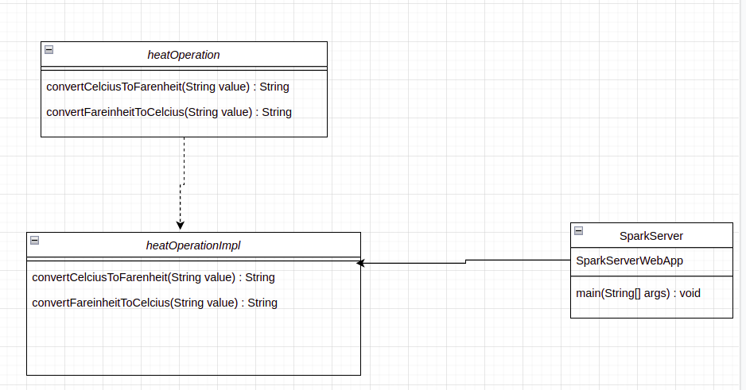
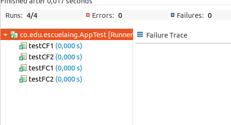
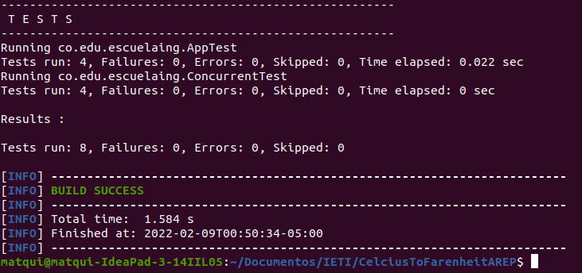

# CelciusToFarenheitAREP

Este proyecto esta desarrollado y construido usando el framework Spark,permite consumir una api mediante web en la que se podra realizar operaciones para pasar grados Celcius a Farenheit o grados Farenheit a Celcius


### Descripcion Arquitectura

Se puede ver la arquitectura que se usa para la implementación de este servicio web, podemos ver la API  que permite consultar la operacion para pasar los grados de celcius a Farenheit, la Interface que se usa para adquirir los comportamientos de la api y una aplicación de Spark que la consume para prestar un servicio.




### TEST

Se generaron 2 test para cada una de las operaciones a realizar donde se verifica la funcionalidad de la api




### Como Ejecutarlo?

Se debe contar con el proyecto clonado y compilado debidamente usando maven, posteriormente ejecutar el siguiente comando

* Maquinas con distribuciones de linux:
> java -cp target/classes:target/dependency/* co.edu.escuelaing.sparksimpleexample.Server
* Maquina con windows
>java -cp target/classes;target/dependency/* co.edu.escuelaing.sparksimpleexample.Server

### Prerrequisitos

Los pasos a continuación permiten clonar el programa en su computador.


Eston son los requisitos que software que tienen que estar instalados previamente:

```
Maven
```
```
Git
```
```
Fue ejecutado con version java 1.8
```
## Construcción 
* [Maven](https://maven.apache.org/) - Dependencias de maven

## Fecha
* 09 Febrero 2022

## Autores

* **Mateo Quintero Acevedo** 

## Javadoc

* El javadoc fue obtenido mediante la herramienta Eclipse quien cuenta con la opcion de autogenerado
	
## Licencia

En este proyecto se usó la licencia GNU - se puede ver [LICENSE](LICENSE.txt) para más detalles.
